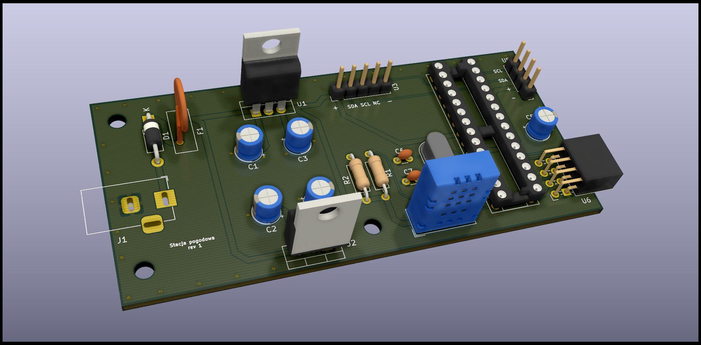

# Schemat Stacji Pogodowej wraz z projektem płytki PCB

Cechy projektu:

+ Wykonany w Kicad
+ Oparty na mikrokontrolerze Atmega328
+ Wykorzystuje Czujnik temperatury i wilgotności DHT 22
+ ...

## Źródła:

+ https://howtomechatronics.com/tutorials/arduino/arduino-wireless-weather-station-project/
